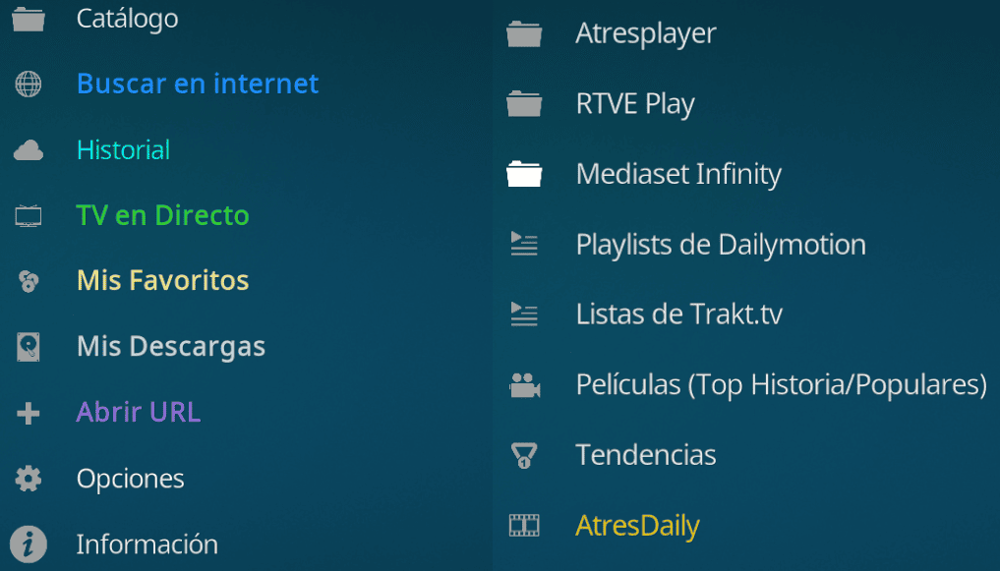

# EspaDaily - Addon para Kodi

 

## Descripción

**EspaDaily** es un potente addon para Kodi que combina la navegación por catálogos de TV española con un buscador universal de vídeo. Funciona como un agregador que permite explorar la estructura de plataformas como Atresplayer, RTVE Play y Mediaset Infinity, buscando automáticamente enlaces públicos disponibles en internet para cada contenido.

### ⚠️ Aviso importante

- Este addon **NO aloja ningún contenido**
- Solo actúa como **buscador de vídeos** en plataformas públicas

 

  <!-- Sube tus capturas a la carpeta 'capturas' y descomenta estas líneas -->
  <!--  -->
  <!--    -->
  <!--  -->

---

## 📥 Instalación

### Opción 1: Desde el Administrador de Archivos de Kodi (Recomendado)
Este es el método más sencillo ya que no requiere descargar archivos externos manualmente y permite actualizaciones automáticas:

1. Abre Kodi y ve a **Ajustes** (icono del engranaje).
2. Entra en **Explorador de archivos** y selecciona **Añadir fuente**.
3. Haz clic en `<Ninguno>` y escribe la siguiente dirección: `https://fullstackcurso.github.io/espadaily/`
   > ⚠️ **MUY IMPORTANTE:** Debes escribir **EXACTAMENTE** esta dirección terminada en `.io/espadaily/`. **NO** copies la dirección que ves en la barra de tu navegador (github.com...), ya que esa no funciona en Kodi y te saldrá la carpeta vacía.
4. Dale un nombre a la fuente (por ejemplo: `espadaily`) y pulsa **OK**.
5. Vuelve al menú principal, entra en **Add-ons** y haz clic en el icono de la **cajita abierta** (arriba a la izquierda).
6. Selecciona **Instalar desde archivo zip**.
   - *Nota: Si te sale un aviso de seguridad, ve a Ajustes y activa la opción "Orígenes desconocidos".*
7. Selecciona la fuente `espadaily` y elige el archivo `repository.espadaily-1.0.0.zip`.
8. Espera a que aparezca la notificación de "Add-on instalado" (esto instala el repositorio).
9. Ahora, en el mismo menú, selecciona **Instalar desde repositorio**.
10. Entra en **EspaDaily Repository** > **Add-ons de vídeo** > **EspaDaily** y pulsa **Instalar**.

### Opción 2: Instalación manual mediante archivo ZIP
1. Descarga el archivo `repository.espadaily-1.0.0.zip` de la última versión desde la sección de **[Releases](../../releases)**.
2. En Kodi, ve a **Add-ons > Icono de la cajita > Instalar desde archivo zip**.
3. Busca en tu dispositivo el archivo descargado y selecciónalo para completar la instalación.

---

## ✨ Características

- **Explorador Unificado**: Navega por Series, Programas, Documentales e Informativos de las principales cadenas de España desde una sola interfaz.
- **Buscador Universal**: ¿No encuentras lo que buscas en los menús? Usa la búsqueda manual para localizar películas, series internacionales o cualquier vídeo en la red.
- **Integración con Palantir**: Conecta búsquedas con Palantir 3 para ampliar resultados.
- **Instantáneas y Backups**: Crea copias de seguridad de los menús y de tu configuración para portabilidad total.
- **Integración de Caché Híbrida**: Sistema inteligente que guarda los menús en tu dispositivo para una navegación ultra rápida, sin esperas de carga.
- **Gestión de Favoritos e Historial**: Guarda tus vídeos preferidos para acceder rápidamente y organizalos de forma avanzada.
- **Descargas**: Opción para descargar contenido y verlo offline (cuando el servidor lo permite).

---

## 📋 Requisitos

- Kodi 19 (Matrix) o superior
- Conexión a internet

---

## ⚖️ Aviso Legal

**EspaDaily** es un proyecto independiente desarrollado sin ánimo de lucro.

1.  **No Afiliación**: Este software NO tiene relación con Atresplayer, RTVE, Mediaset ni ninguna otra entidad oficial.
2.  **Agregador de Búsqueda**: El addon NO aloja, sube ni distribuye contenido protegido. Actúa exclusivamente como un motor de búsqueda automatizado que indexa contenido ya disponible públicamente en internet.
3.  **Responsabilidad**: El usuario es el único responsable del uso de la herramienta y de verificar la legalidad del acceso a los contenidos en su jurisdicción.
4.  Este addon se proporciona "tal cual", sin garantías de ningún tipo.

---

## 💬 Contacto y Soporte

Si quieres informar de algún problema, realizar una consulta o apoyar este proyecto, puedes visitar:

👉 **[Donaciones y Contacto](https://fullstackcurso.github.io/donaciones/#mensaje)**

---

### 📖 Filosofía
Este proyecto nace con la intención de **facilitar el acceso a la cultura audiovisual** y no de sustituir a los servicios oficiales. Cabe destacar que la gran mayoría de los enlaces encontrados por esta herramienta apuntan a contenidos de **baja resolución** (frecuentemente inferiores a 720p), lo que dista mucho de la experiencia *premium* que ofrecen las plataformas de pago.

### Publicidad y Marketing Orgánico
Paradójicamente, este tipo de acceso actúa a menudo como una puerta de entrada y una **potente herramienta de publicidad gratuita**. Ver un episodio suelto o un programa a través de estas vías puede llevar al usuario a comentarlo y compartirlo en redes sociales, generando un ruido digital y un marketing orgánico para la cadena original que, de otro modo, no existiría. Muchos usuarios descubren contenido aquí y, al engancharse, buscan una experiencia superior y mayor comodidad, terminando por **migrar a servicios de suscripción oficiales**.

### Accesibilidad y Realidad Económica
Quienes deciden permanecer consumiendo en baja calidad suelen hacerlo por **barreras económicas**, no por elección; esto significa que rara vez representan una pérdida real de clientes comerciales. Restringir este acceso no convierte a estos usuarios en suscriptores, sino que simplemente amplía la brecha cultural y limita el acceso a la información. 

> Cuando la oferta oficial es sencilla, asequible y de calidad, el usuario tiende a elegirla naturalmente por encima de cualquier otra opción.

### Preservación Histórica
Finalmente, la presencia de estos archivos en la red cumple una función involuntaria de **preservación histórica**. Actúa como una "cápsula del tiempo" para contenido antiguo, descatalogado o de nicho que ya ha desaparecido de los catálogos comerciales, asegurando que estas obras no se pierdan para siempre en el olvido digital.

___

*Addon desarrollado por fullstackcurso*
